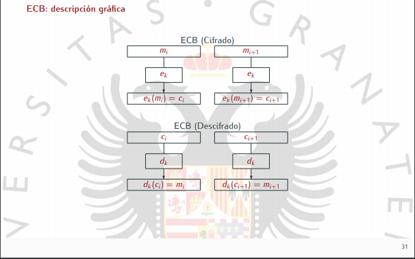
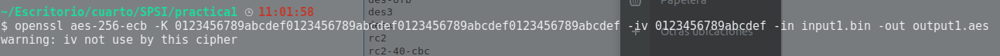
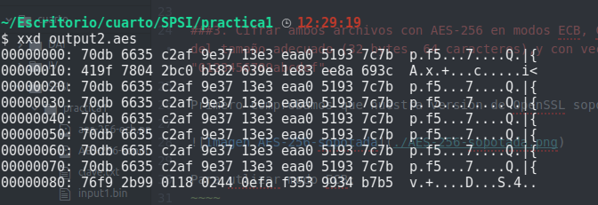
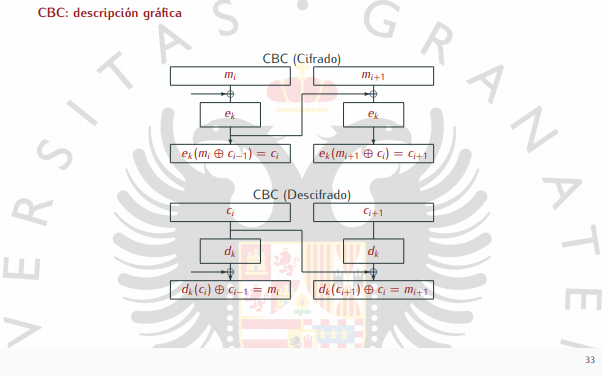
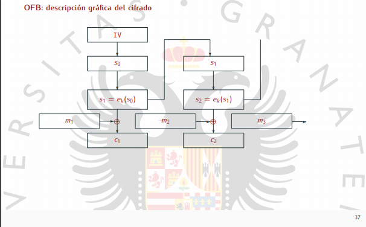

-K clave hexadecimal  256 bits -> 32 en hexadecimal
-pass pass:contraseña password (salt , cadena aleatoria que agrega openssl a la contraseña,evita ataques de diccionario).

Necesitamos un visualizador de archivos hexadecimales. (bless o algo asi)

#Practica 1 SPSI

En este documento explicaremos paso a paso la resolución de la primera práctica de la asignatura SPSI.

##1. y 2.Creación de dos archivos binarios de 1024 bits, uno de ellos con todos los bits a 0 y el otro con un bit a 1 entre el 130 y 150.

Mediante:
~~~~
dd if=/dev/zero of=input1.bin count=128 bs=1
~~~~
Conseguimos un archivo de 1024 bits(128 bytes) totalmente a cero.

***Nota: dev/zero es un archivo propio de Unix que provee de tantos caracteres null como necesitemos.***

Para el segundo archivo, utilizando la herramienta "bless" abrimos el archivo input2.bin e introducimos un 1 en la posición indicada, teniendo en cuenta que cada pareja de ceros (00) es equivalente a 16 bits.

##3. Cifrar ambos archivos con AES-256 en modos ECB, CBC y 0FB usando una clave a elegir del tamaño adecuado (32 bytes, 64 caracteres),y con vector de inicialización "0123456789abcdef".

Primero comprobamos que nuestra versión de OpenSSL soporta AES-256

### modo ECB:

~~~~
openssl aes-256-ecb -K 0123456789abcdef0123456789abcdef0123456789abcdef0123456789abcdef -iv 0123456789abcdef -in input1.bin -out output1.aes

Nota: Hemos inicializado el vector de inicialización, pero ecb no lo utiliza, por lo que
el resultado debe ser el mismo sin importar la cadena de iv que utilicemos.
~~~~

Utilizando xxd output1.aes muestra:

Aplicando el mismo proceso para el segundo archivo:
~~~~
openssl aes-256-ecb -K 0123456789abcdef0123456789abcdef0123456789abcdef0123456789abcdef -iv 0123456789abcdef -in input1.bin -out output1.aes
~~~~

Y mediante xdd:

En el modo ECB, cada bloque de mensaje que se cifra, se cifra de modo independiente al anterior. Por eso todas las lineas que tengan el mismo contenido, un bloque de ceros, se representan de la misma forma, mientras que la linea donde esta el 1 cambia por completo.
La última linea entiendo que cambia por el fin de archivo.

### modo CBC:

~~~~
openssl aes-256-cbc -K 0123456789abcdef0123456789abcdef0123456789abcdef0123456789abcdef -iv 0123456789abcdef -in input1.bin -out output1.aes
~~~~

Aplicamos lo mismo para el segundo archivo y mostramos por pantalla(con xxd) el resultado para compararlo:

En modo CBC el primer bloque del mensaje recibe solo la suma (XOR) con el IV y se le aplica la clave, pero como el primer mensaje no tiene un antecesor, resulta ser un simple XOR con el IV inicial que elegimos. Por esta razón la primera linea de nuestro output1 y output2 coinciden.
Por la misma razón resultan ser todas las linea consiguientes distintas, ya que al modificarse un bit en la segunda linea ya cambia todo el resultado siguiente.

### modo OFB:

En este modo es el vector de inicio el que se ve afectado por la clave, es decir, cuando vaya a cifrar el primer bloque, coge el IV y le aplica la clave, dará un resultado "S1", que se convertirá en el proximo IV para el siguiente bloque, así sucesivamente hasta el final.
Cada resultado de aplicar la clave al IV se aplica en XOR con los distintos bloques de nuestro mensaje.
