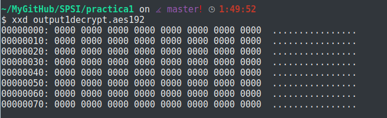

-K clave hexadecimal  256 bits -> 32 en hexadecimal
-pass pass:contraseña password (salt , cadena aleatoria que agrega openssl a la contraseña,evita ataques de diccionario).

Necesitamos un visualizador de archivos hexadecimales. (bless o algo asi)

#Practica 1 SPSI

En este documento explicaremos paso a paso la resolución de la primera práctica de la asignatura SPSI.

##1. y 2.Creación de dos archivos binarios de 1024 bits, uno de ellos con todos los bits a 0 y el otro con un bit a 1 entre el 130 y 150.

Mediante:
~~~~
dd if=/dev/zero of=input1.bin count=128 bs=1
~~~~
Conseguimos un archivo de 1024 bits(128 bytes) totalmente a cero.

***Nota: dev/zero es un archivo propio de Unix que provee de tantos caracteres null como necesitemos.***

Para el segundo archivo, utilizando la herramienta "bless" abrimos el archivo input2.bin e introducimos un 1 en la posición indicada.

##3. Cifrar ambos archivos con AES-256 en modos ECB, CBC y 0FB usando una clave a elegir del tamaño adecuado (32 bytes, 64 caracteres),y con vector de inicialización "0123456789abcdef".

Primero comprobamos que nuestra versión de OpenSSL soporta AES-256

### modo ECB:

~~~~
openssl aes-256-ecb -K 0123456789abcdef0123456789abcdef0123456789abcdef0123456789abcdef -iv 0123456789abcdef -in input1.bin -out output1.aes

Nota: Hemos inicializado el vector de inicialización, pero ecb no lo utiliza, por lo que
el resultado debe ser el mismo sin importar la cadena de iv que utilicemos.
~~~~

Utilizando xxd output1.aes muestra:

Aplicando el mismo proceso para el segundo archivo:
~~~~
openssl aes-256-ecb -K 0123456789abcdef0123456789abcdef0123456789abcdef0123456789abcdef -iv 0123456789abcdef -in input1.bin -out output1.aes
~~~~

Y mediante xdd:

En el modo ECB, cada bloque de mensaje que se cifra, se cifra de modo independiente al anterior. Por eso todas las lineas que tengan el mismo contenido, un bloque de ceros, se representan de la misma forma, mientras que la linea donde esta el 1 cambia por completo.
La última linea entiendo que cambia por el fin de archivo.

### modo CBC:

~~~~
openssl aes-256-cbc -K 0123456789abcdef0123456789abcdef0123456789abcdef0123456789abcdef -iv 0123456789abcdef -in input1.bin -out output1-cbc.aes
~~~~

Aplicamos lo mismo para el segundo archivo y mostramos por pantalla(con xxd) el resultado para compararlo:

En modo CBC el primer bloque del mensaje recibe solo la suma (XOR) con el IV y se le aplica la clave, pero como el primer mensaje no tiene un antecesor, resulta ser un simple XOR con el IV inicial que elegimos. Por esta razón la primera linea de nuestro output1 y output2 coinciden.
Por la misma razón resultan ser todas las linea consiguientes distintas, ya que al modificarse un bit en la segunda linea ya cambia todo el resultado siguiente.

### modo OFB:

Aplicamos el cifrado a los archivos: "input1.bin" y "input2.bin" tal que:
~~~~
openssl aes-256-ofb -K 0123456789abcdef0123456789abcdef0123456789abcdef0123456789abcdef -iv 0123456789abcdef -in input1.bin -out output1-ofb.aes
~~~~
___Repetir con input2.bin___

Una vez cifrado los archivos mostramos los resultados:

En este modo es el vector de inicio el que se ve afectado por la clave, es decir, cuando vaya a cifrar el primer bloque, coge el IV y le aplica la clave, dará un resultado "S1", que se convertirá en el proximo IV para el siguiente bloque, así sucesivamente hasta el final.
Cada resultado de aplicar la clave al IV se aplica en XOR con los distintos bloques de nuestro mensaje.
Es por eso que solo se aprecia una diferencia en la segunda linea , que es donde se encuentra el bit a 1.

## 4. Cifrad input.bin e input1.bin con AES-128 en modo ECB,CBC,OFB usando una contraseña a elegir. Explicad los diferentes resultados.

### ECB

Para realizar un cifrado con contraseña en aes-128-ecb simplemente escribimos en nuestra terminal:
~~~~
openssl aes-128-ecb -in input1.bin -out output1-ecb.aes128

Nos pedirá una contraseña y que la verifiquemos, en mi caso he elegido: 1234
~~~~

Mostramos el resultado de ambos:

Podemos observar en la primera linea: Salted_ ....
En diferencia a cifrar con una clave y un vector inicial elegido por nosotros, openssl se encarga de elegir una ___clave y vector inicial al azar___ de tal forma que el mismo archivo cifrado 2 veces consecutivas con la misma operación(la escrita en el recuadro de antes) mostrará dos resultados completamente diferentes uno de otro vease este ejemplo en el que se muestran dos resultados de cifrar el mismo archivo input1.bin(todo ceros) como indicamos antes:

Por lo demás sigue la misma fórmula que con aes-256-ecb

### CBC

Mismo proceso que antes:

Contraseña:1234

Mostramos los resultados de ambos:

Y volvemos a comparar ahora los resultados de input1:

Comprobamos que al igual que con el ECB, los resultados de cifrar input1 de la misma manera dan como resultado dos cifrados completamente distintos. Aun así, se sigue aplicando CBC con total normalidad.

### OFB

Repetimos proceso pero esta vez con OFB:

Mostramos los resultados de ambos:

Y volvemos a comparar, una vez más, los resultados de input1:

Y, de nuevo, comprobamos que no tienen nada que ver los resultados generados de input1.

Como conclusión, podemos comprobar que openssl establece su propio iv y su propia clave cada vez que se le manda cifrar un archivo, aunque este sea el mismo, lo que si podemos comprobar es que se cifran tal cual viene explicado en el ejercicio anterior.

## 5 Repetir el punto anterior con la opcion -nosalt.

Con la opción -nosalt , evitamos la aleatoriedad a la hora de cifrar el archivo mediante una contraseña, vamos a comprobarlo:

### ECB

Creación de archivos:

Comparamos entre los dos:

Por último comparamos input1 consigo mismo creandolo de nuevo:

### CBC

Creación de archivos:

Comparamos entre los dos:

Por último comparamos input1 consigo mismo creandolo de nuevo:

### OFB

Creación de archivos:

Comparamos entre los dos:

Por último comparamos input1 consigo mismo creandolo de nuevo:

Podemos observar que, evidentemente, ahora elige la misma clave y el mismo iv para el mismo archivo y ya no existe ningun tipo de aleatoriedad.

## 6. Cifrar input1.bin con aes-192 en modo OFB, clave y vector de inicialización a elegir(no contraseña).Supongamos que la salida es output.bin

La clave en aes-192 deberá de ser de 48 carácteres, pues que 192 bits corresponde a 48 caracteres hexadecimales que ocupan 4 bits cada uno.
Para este ejercicio elegiremos como clave K :
___0123456789abcdef0123456789abcdef0123456789abcdef___

Como vector inicial: ___0123456789abcdef___

Para cifrar el archivo utilizamos:
~~~~
openssl aes-192-ofb -K 0123456789abcdef0123456789abcdef0123456789abcdef -iv 0123456789abcdef -in input1.bin -out output1.aes
~~~~

Mostramos el resultado:

## 7. Descifrar output.bin utilizando la misma clave y vector de inicialización que en el ejercicio 6.

Para descifrar un archivo cifrado con ___AES-XXX___ tan solo hace falta utilizar el parámetro -d, añadiendo además como entrada ___-in "el archivo cifrado"___ y como salida ___-out "el archivo descrifrado"___.
Después para visualizar el archivo, basta con utilizar xxd "el nombre del archivo de salida", a continuación se muestra una imagen de como realizarlo:

## 8. Vuelve a cifrar output.bin(el archivo cifrado) con aes-192 en modo OFB, clave y vector de inicialización del ejercicio 6. Compara el resultado obtenido con el punto 7, explicando el resultado.

Para cifrar de nuevo el archivo basta con pasarle al output el mismo cifrado tal que:

Comparamos el resultado del ejercicio 7 con el 8:

Podemos observar que cuando a un archivo ___A___ le aplicamos un cifrado obtenemos ___A'___, y a partir de aqui,tanto si desciframos como si ciframos ___A'___ obtenemos ___A___.
Esto es debido a que el cifrado por OFB realiza la operacion tal que:
~~~~
  IV --> So --> S1 = Ek(So) --> ..... S2 --> .....  Sn
                      |xor            |xor          |xor
                      M1              M2            Mn
~~~~
De tal forma que al aplicarlo sobre nuestro mensaje el cual está a cero en todos los bits resulta que nuestro archivo output esta formado por los distintos bloques de la forma:
~~~~
  S1,S2,...Sn ; Es decir, el resultado de nuestro archivo cifrado es el vector inicial
  aplicandole la clave(S1), S1 aplicandole la clave(S2),....,Sn-1 aplicandole la clave(Sn)
~~~~
Por tanto, al volver a aplicar, con el mismo IV y clave la operacón XOR al bloque cifrado obtenemos:
~~~~
  S1 xor S1 = 0
  S2 xor S2 = 0
  ....
  Sn xor Sn = 0
~~~~
Esta es la razón por la que al descifrar y al cifrar el primer archivo output obtenemos el mismo resultado.

## 9. Repetir los puntos 6,7 y 8 pero empleando contraseña en lugar de clave y vector de inicialización.

Como contraseña elegiremos al igual que en ejercicios anteriores: 1234

1. Empezaremos realizando el apartado 6(Cifrar input1.bin con aes-192 en modo OFB con pass):

2. En el apartado 7(Descriframos utilizando la pass del ejercicio 6)

3. Apartado del ejercicio 8(cifrar de nuevo la salida anterior con la misma contraseña,1234):

Esta vez, podemos ver que el resultado no es el mismo, esto es por la aleatoriedad a la hora de elegir el IV y la clave al cifrar los archivos, en consecuencia, la primera vez se realizo el XOR con un IV y una Clave, que después fueron distintas, como consecuencia, el resultado es el obtenido.

## 10. Presentar otro algoritmo de cifrado simétrico que aparezca en mi implementación de openssl

#### MD5

MD5, es uno de los cifrados más usados en la red. Este algoritmo cifra normalmente con un número de 32 símbolos hexadecimales. De tal manera que si aplicamos a un simple mensaje: "abcde", un cifrado por md5 resulta un numero de 32 dígitos, el cual, será totalmente diferente con un simple cambio como puede ser: "abcdf"

 En sus inicios se consideraba como un algoritmo de cifrado seguro, hasta que se habló de la colisión de hash

Longitud del resultado 32 dígitos
