# Practica 2 SPSI

## Generar una clave RSA (que contiene el par de claves) de 901 bits. El nombre de la clave será <nombre>RSAkey.pem. La pública no debe estar cifrada ni protegido.

Para generar una clave RSA utilizaremos el comando:

~~~~
openssl genrsa -out <nombre>RSAkey.pem 901
~~~~

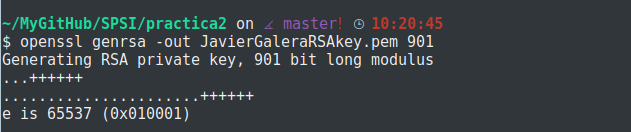

Aunque en la imagen resalte que el resultado de aplicar este comando sea el de generar una clave privada, no hay que causar alarma, la generación de la clave privada va ligada de la mano de la creación de una clave pública. Ambas están en el mismo archivo, para comprobarlo utilizaremos:

~~~~
openssl rsa -in <nombre>RSAkey.pem -text -noout
~~~~

Con el parámetro -text, añade al archivo de las claves los valores de estas en formato texto, y con -noout conseguimos que no haya salida de la operación, por lo que se mostrarán por pantalla:

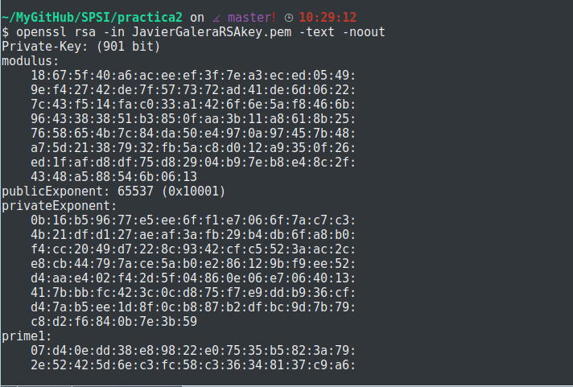
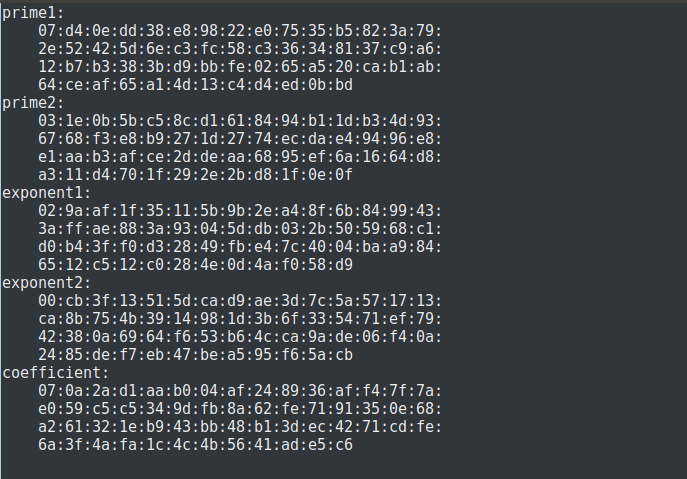

## Extraer la clave privada contenida en el archivo <nombre>RSAkey.pem a otro archivo que tenga por nombre <nombre>RSApriv.pem. Este archivo deberá estar protegido por contraseña cifrándolo con AES-128.Mostrar sus valores.

Para extraer la parte privada de nuestra clave utilizamos:

~~~~
openssl rsa -in <nombre>RSAkey.pem -out <nombre>RSApriv.pem -des
~~~~

***NOTA***:Como contraseña utilizamos por recomendación del profesor:0123456789

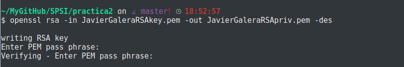

Ahora mostramos el resultado de nuestra clave privada:

~~~~
openssl rsa -in <nombre>RSApriv.pem -text -noout
~~~~

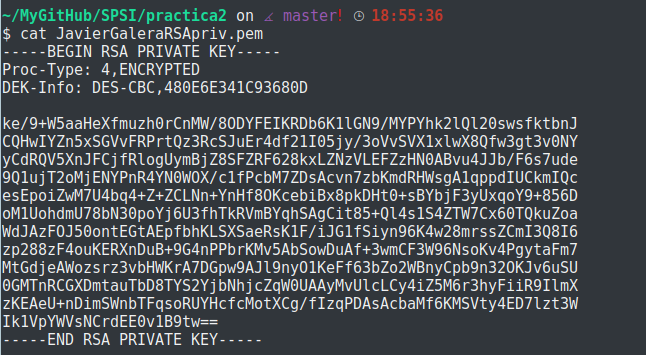

Comprobamos en el apartado "DEK-info" que el archivo ha sido cifrado por DES en modo "CBC"

## Extraer en <nombre>RSApub.pem la clave pública contenida en el archivo <nombre>RSApub.pem no debe estar cifrado ni protegido.Mostrar sus valores.

Para extraer la parte pública del archivo utilizamos:

~~~~
openssl rsa -in <nombre>RSAkey.pem -pubout -out <nombre>RSApub.pem
~~~~

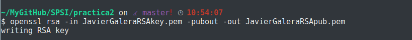

Ahora mostraremos el resultado de nuestra clave pública:

~~~~
openssl rsa -in <nombre>RSApub.pem -pubin -text -noout

NOTA: por defecto a la hora de extrar, openssl entiende que las claves son
privadas, es por eso que hay que añadir el parametro -pubin.
~~~~
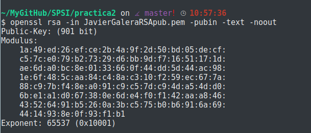

## Reutilizar el archivo binario input.bin de 1024 bits, todos ellos con valor a 0, de la practica anterior. Intentar cifrar input.bin con la clave pública y explicar el mensaje de error obtenido.

Para intentar cifrar el archivo input.bin utilizaremos el comando:

~~~~
openssl rsautl -encrypt -inkey <nombre>RSApub.pem -pubin -in input.bin -out
resultado.ssl
~~~~

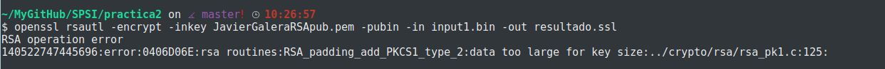

Nos muestra un error:

~~~~
RSA operation error
140522747445696:error:0406D06E:rsa routines:RSA_padding_add_PKCS1_type_2:data
too large for key size:../crypto/rsa/rsa_pk1.c:125:
~~~~

"KeyPubli: 901 bits" ; "Input.bin: 1024 bits" ;
El parámetro "rsautl" no cifra ningún dato de entrada que sea más grande que el tamaño de la clave RSA. 901 < 1024, por lo tanto no puede cifrar el archivo.

## Diseñar un cifrado híbrido, con RSA como criptosistema asimétrico. El modo de proceder será el siguiente:

~~~~
1. El emisor debe seleccionar un sistema simétrico con su correspondiente
modo de operación.
2. El emisor generará un archivo de texto, llamado por ejemplo "sessionkey"
con dos líneas. La primera línea contendrá una cadena aleatoria hexadecimal
cuya longitud sea la requerida para la clave del criptosistema simétrico.
OpenSSL permite generar cadenas aleatorias con el comando openssl rand.
La segunda línea contendrá la información del criptosistema simétrico
seleccionado. Por ejemplo, si hemos decidido emplear el algoritmo de Blowfish
en modo ECB, la segunda línea debería contener -bf-ecb.
3. El archivo "sessionkey" se cifrará con la clave pública del receptor.
4. El mensaje se cifrará utilizando el criptosistema simétrico, la clave se
generará a partir del archivo anterior mediante la operación:
-pass file:sessionkey.s
~~~~

- Apartado 1: Escogeremos el modo ECB-256.
- Apartado 2: Creación del arhivo.

Para nuestra clave utilizaremos el comando: openssl rand -hex 32
De esta forma generará en la primera línea los 64 bits que necesitamos.

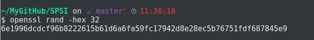

En la segunda línea contendrá: -bf-ecb

Comprobamos el estado del archivo final:

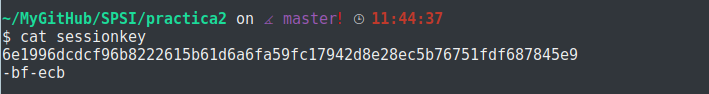

- Apartado 3: Para cifrar el archivo "sessionkey" con la clave publica del receptor, primero necesitamos la clave pública de este:

Para ello seguiremos los puntos anteriores para ellos "<nombre>" tomará el valor de "Receptor".

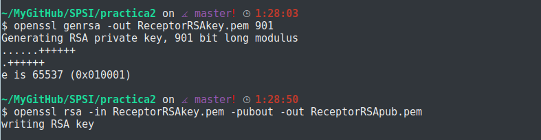

Utilizamos el siguiente comando:
~~~~
openssl rsautl -encrypt -in sessionkey -out sessionkey.enc -inkey
ReceptorRSApub.pem -pubin
~~~~

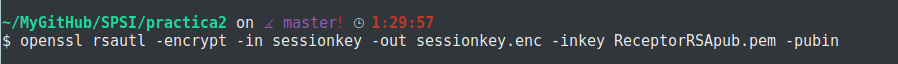

- Apartado 4: Por último una vez tenemos el archivo sessionkey.enc cifraremos con ECB-256 y utilizando como clave el archivo "sessionkey.enc" el mensaje del emisor, el mensaje estará en el archivo "mensaje.txt".

Para ello utilizamos el comando:
~~~~
openssl enc -aes-256-ecb -pass file:sessionkey.enc -in mensaje.txt -out
mensaje.enc
~~~~

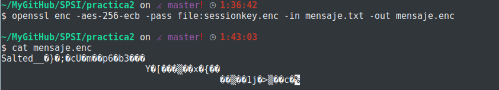

## Utilizando el criptosistema híbrido diseñado, se debe cifrar el archivo input.bin con la propia clave pública. Y a continuación, descifrarlo con la clave privada y compararlo con el resultado original.

Ciframos input.bin:
~~~~
openssl enc -aes-256-ecb -pass file:sessionkey -in input1.bin
-out encryptInput.bin
~~~~

Con esto utilizamos la clave de sesión generada anteriormente(sessionkey).
El archivo cifrado quedaría tal que:

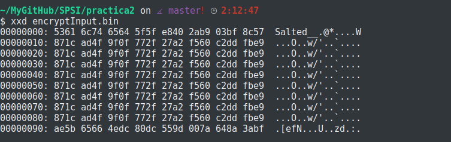

Ya tenemos cifrado el archivo, ahora vamos a descifrarlo. Al utilizar el cifrado híbrido le daríamos al receptor el sessionkey cifrado y en mensaje cifrado. El receptor debe descifrar con su clave privada el sessionkey y una vez hecho esto aplicar el descifrado del criptosistema simétrico que se encuentra en el archivo "sessionkey".
(Previamente hemos cifrado sessionkey con nuestra clave pública, pues el emisor y el receptor en este caso soy yo mismo).

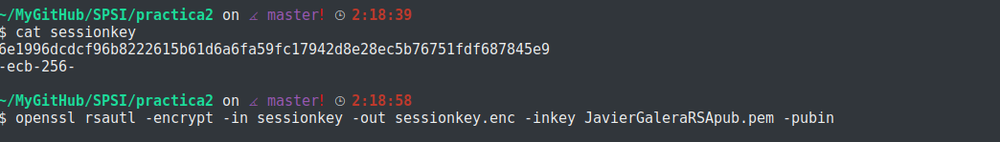

Utilizamos:

~~~~
openssl rsautl -decrypt -in sessionkey.enc -out sessionkey.denc
-inkey JavierGaleraRSApriv.pem
~~~~

Mostramos el resultado:

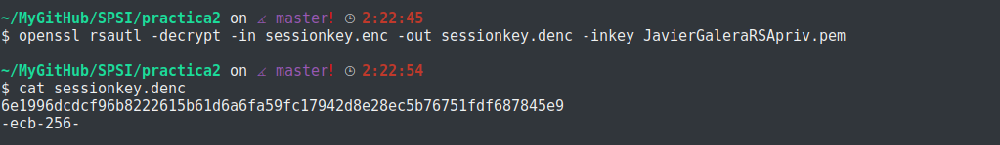

Podemos comprobar que el resultado era el esperado, una vez tenemos el archivo descifrado de forma correcta, usamos el cifrado simétrico para descifrar el archivo encryptInput.bin, para ello utilizamos:

~~~~
openssl enc -aes-256-ecb -pass file:sessionkey.denc
-in encryptInput.bin -out decryptInput.bin
~~~~

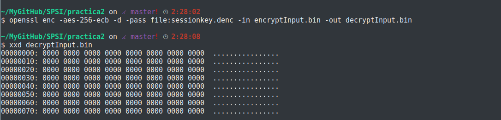

El sistema funciona, hemos conseguido descifrar el mensaje.

## Generar un archivo stdECparam.pem que contenga los parámentros públicos de una de las curvas elípticas contenidas en las transparencias de teoría. Si no se logra localizarla realizar el resto de la práctica con una curva cualquiera a vuestra elección de las disponibles en OpenSSL. Mostrar los valores.

Para ver el listado de curvas elípticas disponibles en OpenSSL usaremos el comando ___ecparam___. Con este comando también podremos manipular y generar dichas curvas.

Tipos(algunas) de curvas predefinidas en OpenSSL:
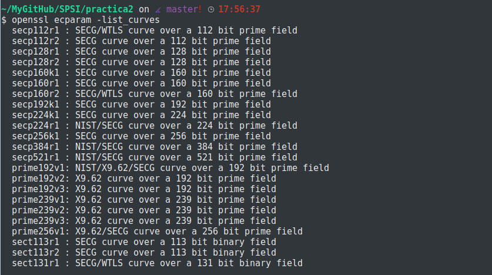

En mi caso escogeremos ___prime256v1___.

Crearemos el archivo mediante:

~~~~
openssl ecparam -out stdECparam.pem -name prime256v1
~~~~

El archivo creado:

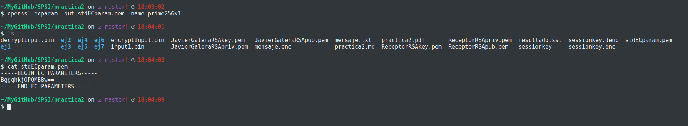

información del archivo:

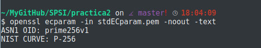

Comprobamos que hay 2 líneas: ___ASN1 OID___ y ___NIST CURVE___.

  1. OID es un nombre usado para identificar al objeto, ASN1(Abstract Syntax Notation One) es un protocolo de nivel de presentación del modelo OSI. ASN1 es una norma para representar datos de forma abstracta, haciendo posible que sean validos independientemente de la máquina empleada y sus formas de representación internas.

  2. NIST(The National Institute of Standards and Technology) CURVE tiene el nombre de la curva en el standard, en nuestro caso P-256.

## Generar una clave para los parámentros anteriores. La clave se almacenará en <nombre>ECkey.pem y no es necesario protegerla por contraseña.

Para ello, y a partir del parámetro anterior ___ecparam___, escribimos en la terminal:

~~~~
openssl ecparam -in stdECparam.pem -out JavierGaleraECkey.pem -genkey
~~~~

Añadimos __-genkey__ para indicarle que genere la clave privada asociada a la curva elíptica con los parámetros introducidos.

Así el archivo queda tal que:

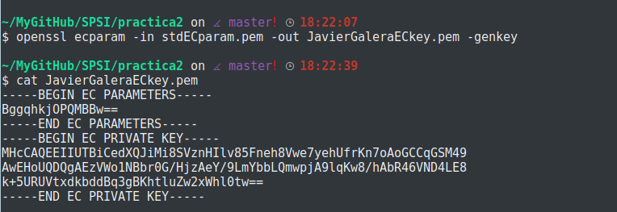

## "Extraer" la clave privada contenida en el archivo <nombre>ECkey.pem a otro archivo que tenga por nombre <nombre>ECpriv.pem. Este archivo deberá estar protegido por contraseña. Mostrar los valores

Como en los ejercicios anteriores con RSA extraeremos y protegeremos con contraseña utilizaremos el comando:

~~~~
openssl ec -in nombreECkey.pem -des -out nombreECpriv.pem
~~~~

***NOTA***:Como contaseña por recomendación se ha utilizado: 0123456789

Podemos comprobar ahora el archivo:

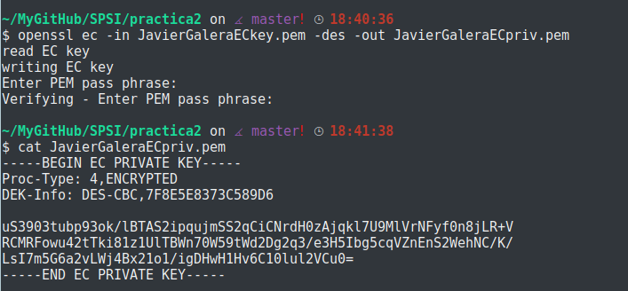

En la información comprobamos que se ha cifrado con "DES" en modo "CBC" el resto es la información necesaria para que, junto a la contraseña, se descifre el archivo.

## Extraer en <nombre>ECpub.pem la clave pública ccontenida en el archivo <nombre>ECkey.pem. Xomo antes, no debe de estar cifrada ni protegida. Mostrar sus valores.

Para ello utilizamos el comando:

~~~~
openssl ec -in nombreECkey.pem -pubout -out nombreECpub.pem
~~~~

Comprobamos ahora el archivo:

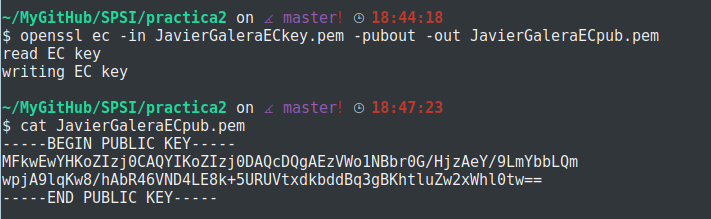
