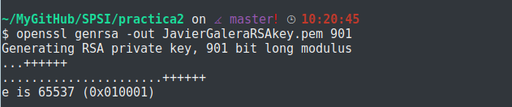
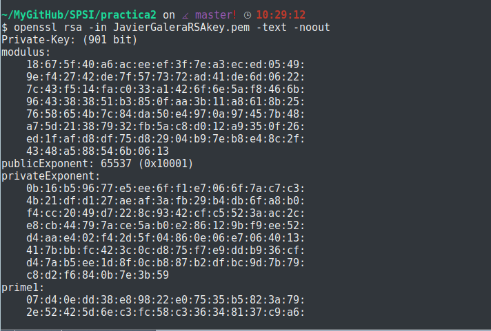
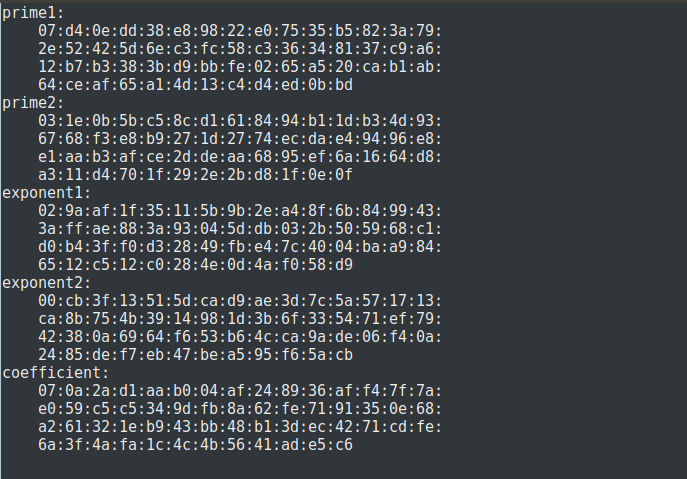
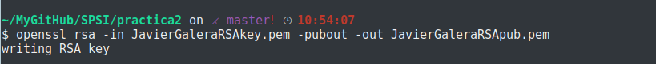
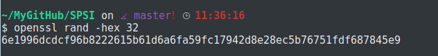

# Practica 2 SPSI

## Generar una clave RSA (que contiene el par de claves) de 901 bits. El nombre de la clave será <nombre>RSAkey.pem. La pública no debe estar cifrada ni protegido.

Para generar una clave RSA utilizaremos el comando:

~~~~
openssl genrsa -out <nombre>RSAkey.pem 901
~~~~

Aunque en la imagen resalte que el resultado de aplicar este comando sea el de generar una clave privada, no hay que causar alarma, la generación de la clave privada va ligada de la mano de la creación de una clave pública. Ambas están en el mismo archivo, para comprobarlo utilizaremos:

~~~~
openssl rsa -in <nombre>RSAkey.pem -text -noout
~~~~

Con el parámetro -text, añade al archivo de las claves los valores de estas en formato texto, y con -noout conseguimos que no haya salida de la operación, por lo que se mostrarán por pantalla:

## Extraer la clave privada contenida en el archivo <nombre>RSAkey.pem a otro archivo que tenga por nombre <nombre>RSApriv.pem. Este archivo deberá estar protegido por contraseña cifrándolo con AES-128.Mostrar sus valores.

Para extraer la parte privada de nuestra clave utilizamos:

~~~~
openssl rsa -in <nombre><RSAkey.pem -out <nombre>RSApriv.pem
~~~~

Ahora mostramos el resultado de nuestra clave privada:

~~~~
openssl rsa -in <nombre>RSApriv.pem -text -noout
~~~~

## Extraer en <nombre>RSApub.pem la clave pública contenida en el archivo <nombre>RSApub.pem no debe estar cifrado ni protegido.Mostrar sus valores.

Para extraer la parte pública del archivo utilizamos:

~~~~
openssl rsa -in <nombre>RSAkey.pem -pubout -out <nombre>RSApub.pem
~~~~

Ahora mostraremos el resultado de nuestra clave pública:

~~~~
openssl rsa -in <nombre>RSApub.pem -pubin -text -noout

NOTA: por defecto a la hora de extrar, openssl entiende que las claves son privadas, es por eso que hay que añadir el parametro -pubin.
~~~~

## Reutilizar el archivo binario input.bin de 1024 bits, todos ellos con valor a 0, de la practica anterior. Intentar cifrar input.bin con la clave pública y explicar el mensaje de error obtenido.

Para intentar cifrar el archivo input.bin utilizaremos el comando:

~~~~
openssl rsautl -encrypt -inkey <nombre>RSApub.pem -pubin -in input.bin -out resultado.ssl
~~~~

Nos muestra un error:

~~~~
RSA operation error
140522747445696:error:0406D06E:rsa routines:RSA_padding_add_PKCS1_type_2:data too large for key size:../crypto/rsa/rsa_pk1.c:125:
~~~~

"KeyPubli: 901 bits" ; "Input.bin: 1024 bits" ;
El parámetro "rsautl" no cifra ningún dato de entrada que sea más grande que el tamaño de la clave RSA. 901 < 1024, por lo tanto no puede cifrar el archivo.

## Diseñar un cifrado híbrido, con RSA como criptosistema asimétrico. El modo de proceder será el siguiente:

~~~~
1. El emisor debe seleccionar un sistema simétrico con su correspondiente modo de operación.
2. El emisor generará un archivo de texto, llamado por ejemplo "sessionkey" con dos líneas. La primera línea contendrá una cadena aleatoria hexadecimal cuya longitud sea la requerida para la clave del criptosistema simétrico. OpenSSL perimite generar cadenas aleatorias con el comando openssl rand. La segunda línea contendrá la información del criptosistema simétrico seleccionado. Por ejemplo, si hemos decididio emplear el algoritmo de Blowfish en modo ECB, la segunda línea debería conteener -bf-ecb.
3. El archivo "sessionkey" se cifrará con la clave pública del receptor.
4. El mensaje se cifrará utilizando el criptosistema simétrico, la clave se generará a partir del archivo anterior mediante la operación:
-pass file:sessionkey.s
~~~~

- Apartado 1: Escogeremos el modo ECB-256.
- Apartado 2: Creación del arhivo.

Para nuestra clave utilizaremos el comando: openssl rand -hex 32
De esta forma generará en la primera línea los 64 bits que necesitamos.

En la segunda línea contendrá: -bf-ecb

Comprobamos el estado del archivo final:

