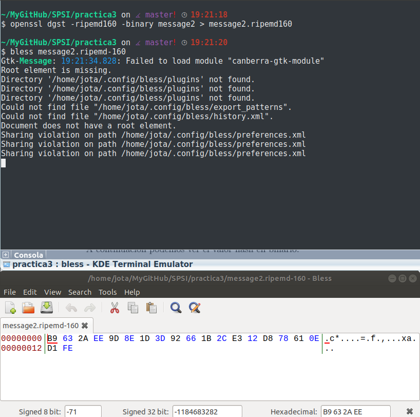

# Practica 3

## 1.Generar un archivo sharedDSA.pem que contenga los parámetros. Mostrar los valores:

Utilizaremos el comando "dsaparam" que nos permite generar y manipular parámetros asociados al algoritmo DSA: primos ___p___ y ___q____ y el generador ___g___.

~~~~
openssl dsaparam -out sharedDSA.pem 901

~~~~
Así se generará el resultado con un tamaño de 901 bits.

La consola nos mostrará algo como esto:

Los valores obtenidos en hexadecimal tras generar el archivo son estos:

## 2.Generar dos parejas de claves para los parámetros anteriores. Las claves se almacenarán en los archivos <nombre>DSAkey.pem y <apellido>DSAkey.pem. No es necesario protegerlas con contraseña.

Para generar la pareja de claves necesitamos del archivo anterior (sharedDSA.pem) el cual actuará como parámetro. Esta vez utilizaremos el comando de openssl ***gedsa***.

En primer lugar generamos el par para Javier:
~~~~
openssl gendsa -out JavierDSAkey.pem sharedDSA.pem
~~~~

Por último, las generamos para Galera:
~~~~
openssl gendsa -out GaleraDSAkey.pem sharedDSA.pem
~~~~

Ya tenemos generadas las dos parejas de claves.

## 3."Extraer" la clave privada contenida en el archivo <nombre>DSAkey.pem a otro archivo que tenga por nombre <nombre>DSApriv.pem. Este archivo deberá estar protegido por contraseña. Mostrad sus valores. Haced lo mismo para el archivo <apellido>DSAkey.pem

Para realizarlo utilizaremos el comando de openssl ***dsa***. El cual nos permitirá sustraer la clave public y/o privada.Además utilizaremos como cifrado simétrico AES-128 y como contraseña: 0123456789

De esta forma extraeremos y cifraremos la clave privada de Javier:
~~~~
openssl dsa -in JavierDSAkey.pem -out JavierDSApriv.pem -aes128
~~~~

Del mismo modo para Galera:

Por último mostraremos el resultado de dichas claves, a través del comando:
~~~~
openssl dsa -in <nombre>DSApriv.pem -text -noout
~~~~

De ***Javier***:

De ***Galera***:

## 4.Extraer en <nombre>DSApub.pem la clave pública contenida en el archivo <nombre>DSAkey.pem. De nuevo <nombre>DSApub.pem no debe estar cifrado ni protegido. Mostrad sus valores. Lo mismo para el archivo <galera>DSAkey.pem

Al igual que en el apartado anterior, utilizaremos el comando de openssl ***dsa***.

Para la extracción de la clave pública utilizaremos el comando:
~~~~
openssl dsa -in <nombre>DSAkey.pem -out <nombre>DSApub.pem -pubout
~~~~

Tanto para Javier como para Galera:

Por último mostraremos los valores de las claves:

Para ***Javier***:

Para ***Galera***:

## 5. Coger un archivo que actuará como entrada, de al menos 128 bytes. En adelante, dicho archivo será denominado como "message".

Para crear el archivo utilizaremos:
~~~~
dd if=/dev/zero of=message count=1024 bs=1
~~~~

El parámetro count recibe el número de bits del archivo que se creará.
Hemos introducido 1024, pues 128 bytes * 8 bits/byte = 1024 bits.
El archivo será una retahíla de ceros, puesto que solo hemos creado el archivo, no lo hemos modificado nada.

## 6.Firmar directamente el archivo message empleando el comando openssl pkeyutl sin calcular los valores hash, la firma deberá almacenarse en un archivo llamado message.sign. Mostrad el archivo con la firma.

Para firmar el archivo utilizaremos la clave privada de Javier con el comando:
~~~~
openssl pkeyutl -sign -in message -inkey <nombre>DSApriv.pem -out message.bin
~~~~

Ahora mostraremos el original y el resultado:

#####Original

#####Firmado

## 7.Construir un archivo message2 diferente de message tal que la verificación de la firma message.sign sea correcta con respecto al archivo message2.

Para ello crearemos un archivo message2, en este caso será del doble de tamaño que message(2048 bits):

Ahora introduciremos al final, en los últimos bits, un cambio para comprobar que aún asi verificará la firma:

Ahora utilizando este comando comprobaremos la verificación:
~~~~
openssl pkeyutl -verify -in message2 -sigfile message.sign -pubin -inkey <nombre>DSApub.key
~~~~

Esto tiene una explicación "simple", resulta que ***pkeyutl*** tiene un   __pequeño__ ***BUG***. Si firmamos un archivo con "message" de 128 bits(a 0 todos los bits o bien a un contenido "X") y creamos un archivo "message2" de 129 bits o más, donde los primermos 128 bits coinciden con los de "message", resulta que verifica la firma. Esto es debido a que trunca (algo así como "recortar") el archivo "message2" a partir de los 128 primeros bits.

## 8.Calcular el valor hash del archivo con la clave pública <nombre>DSApub.pem usando sha384 con salida hexadecimal con bloques de dos caracteres separados por dos puntos. Mostad los valores por salida estándar y guardarlos en <nombre>DSApub.sha384.

Para ello utilizaremos el siguiente comando:
~~~~
openssl dgst -c -sha384 -hex <nombre>DSApub.pem > <nombre>DSApub.sha384
~~~~

Además mostraremos también el resultado:

Aquí podemos comprobar que se ha aplicado ___sha384___.

Además se puede mostrar por pantalla el resultado directamente con este comando:
~~~~
openssl dgst -c -sha384 -hex <nombre>DSApub.pem && xdd <nombre>DSApub.pem
~~~~

## 9. Calcular el valor hash de message2 usando una función hash de 160 bits con salida binaria. Guardad el hash en message2.<algoritmo> y mostrar su contenido.

En este caso utilizaremos RIPEMD-160, con ello el comando utilizado será:

~~~~
openssl dgst -binary -ripemd160 message2 > message2.ripemd160
~~~~

Aquí podemos observar el contenido del archivo y la creación de este:

## 10. Firmad el archivo message2 mediante el comando openssl dgst y la funcion hash del punto anterior. La firma deberá almacenarse en un archivo llamando message2.sign

~~~~
openssl dgst -ripemd160 -sign <nombre>DSApriv.pem -out message2.sign message2
~~~~

## 11. Verificad la firma message2.sign con los archivos message y message2  empleando el comando openssl dgst.

~~~~
openssl dgst -sha1 -verify JavierDSApub.pem -signature message2.sign message2
~~~~

## 12.

~~~~
openssl pkeyutl -verify -in message2 -sigfile message.sign -pubin -inkey <nombre>DSApub.key
~~~~

