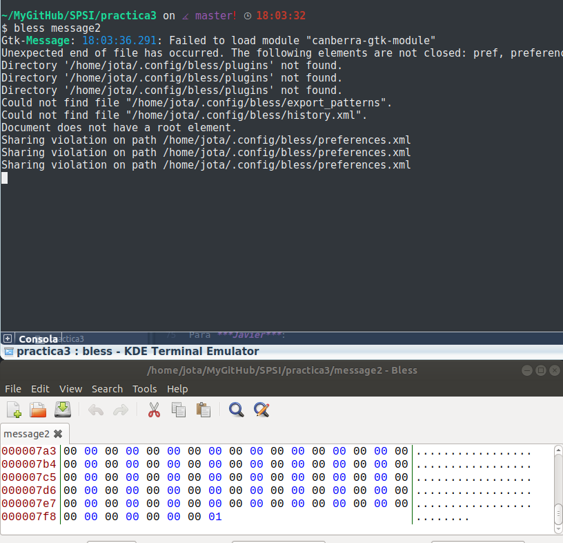
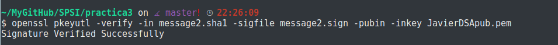

# Practica 3

## 1.Generar un archivo sharedDSA.pem que contenga los parámetros. Mostrar los valores:

Utilizaremos el comando "dsaparam" que nos permite generar y manipular parámetros asociados al algoritmo DSA: primos ___p___ y ___q____ y el generador ___g___.

~~~~
openssl dsaparam -out sharedDSA.pem 901

~~~~
Así se generará el resultado con un tamaño de 901 bits.

La consola nos mostrará algo como esto:

Los valores obtenidos en hexadecimal tras generar el archivo son estos:

## 2.Generar dos parejas de claves para los parámetros anteriores. Las claves se almacenarán en los archivos <nombre>DSAkey.pem y <apellido>DSAkey.pem. No es necesario protegerlas con contraseña.

Para generar la pareja de claves necesitamos del archivo anterior (sharedDSA.pem) el cual actuará como parámetro. Esta vez utilizaremos el comando de openssl ***gedsa***.

En primer lugar generamos el par para Javier:
~~~~
openssl gendsa -out JavierDSAkey.pem sharedDSA.pem
~~~~

Por último, las generamos para Galera:
~~~~
openssl gendsa -out GaleraDSAkey.pem sharedDSA.pem
~~~~

Ya tenemos generadas las dos parejas de claves.

## 3."Extraer" la clave privada contenida en el archivo <nombre>DSAkey.pem a otro archivo que tenga por nombre <nombre>DSApriv.pem. Este archivo deberá estar protegido por contraseña. Mostrad sus valores. Haced lo mismo para el archivo <apellido>DSAkey.pem

Para realizarlo utilizaremos el comando de openssl ***dsa***. El cual nos permitirá sustraer la clave public y/o privada.Además utilizaremos como cifrado simétrico AES-128 y como contraseña: 0123456789

De esta forma extraeremos y cifraremos la clave privada de Javier:
~~~~
openssl dsa -in JavierDSAkey.pem -out JavierDSApriv.pem -aes128
~~~~

Del mismo modo para Galera:

Por último mostraremos el resultado de dichas claves, a través del comando:
~~~~
openssl dsa -in <nombre>DSApriv.pem -text -noout
~~~~

De ***Javier***:

De ***Galera***:

## 4.Extraer en <nombre>DSApub.pem la clave pública contenida en el archivo <nombre>DSAkey.pem. De nuevo <nombre>DSApub.pem no debe estar cifrado ni protegido. Mostrad sus valores. Lo mismo para el archivo <galera>DSAkey.pem

Al igual que en el apartado anterior, utilizaremos el comando de openssl ***dsa***.

Para la extracción de la clave pública utilizaremos el comando:
~~~~
openssl dsa -in <nombre>DSAkey.pem -out <nombre>DSApub.pem -pubout
~~~~

Tanto para Javier como para Galera:

Por último mostraremos los valores de las claves:

Para ***Javier***:

Para ***Galera***:

## 5. Coger un archivo que actuará como entrada, de al menos 128 bytes. En adelante, dicho archivo será denominado como "message".

Para crear el archivo utilizaremos:
~~~~
dd if=/dev/zero of=message count=1024 bs=1
~~~~

El parámetro count recibe el número de bits del archivo que se creará.
Hemos introducido 1024, pues 128 bytes * 8 bits/byte = 1024 bits.
El archivo será una retahíla de ceros, puesto que solo hemos creado el archivo, no lo hemos modificado nada.

## 6.Firmar directamente el archivo message empleando el comando openssl pkeyutl sin calcular los valores hash, la firma deberá almacenarse en un archivo llamado message.sign. Mostrad el archivo con la firma.

Para firmar el archivo utilizaremos la clave privada de Javier con el comando:
~~~~
openssl pkeyutl -sign -in message -inkey <nombre>DSApriv.pem -out message.bin
~~~~

Ahora mostraremos el original y el resultado:

#####Original

#####Firmado

## 7.Construir un archivo message2 diferente de message tal que la verificación de la firma message.sign sea correcta con respecto al archivo message2.

Para ello crearemos un archivo message2, en este caso será del doble de tamaño que message(2048 bits):

Ahora introduciremos al final, en los últimos bits, un cambio para comprobar que aún asi verificará la firma:

Ahora utilizando este comando comprobaremos la verificación:
~~~~
openssl pkeyutl -verify -in message2 -sigfile message.sign -pubin -inkey <nombre>DSApub.key
~~~~

Esto tiene una explicación "simple", resulta que ***pkeyutl*** tiene un   __pequeño__ ***BUG***. Si firmamos un archivo con "message" de 128 bits(a 0 todos los bits o bien a un contenido "X") y creamos un archivo "message2" de 129 bits o más, donde los primermos 128 bits coinciden con los de "message", resulta que verifica la firma. Esto es debido a que trunca (algo así como "recortar") el archivo "message2" a partir de los 128 primeros bits.

## 8.Calcular el valor hash del archivo con la clave pública <nombre>DSApub.pem usando sha384 con salida hexadecimal con bloques de dos caracteres separados por dos puntos. Mostad los valores por salida estándar y guardarlos en <nombre>DSApub.sha384.

Para ello utilizaremos el siguiente comando:
~~~~
openssl dgst -c -sha384 -hex <nombre>DSApub.pem > <nombre>DSApub.sha384
~~~~

Además mostraremos también el resultado:

Aquí podemos comprobar que se ha aplicado ___sha384___.

Además se puede mostrar por pantalla el resultado directamente con este comando:
~~~~
openssl dgst -c -sha384 -hex <nombre>DSApub.pem && xdd <nombre>DSApub.pem
~~~~

## 9. Calcular el valor hash de message2 usando una función hash de 160 bits con salida binaria. Guardad el hash en message2.<algoritmo> y mostrar su contenido.

En este caso utilizaremos SHA1, con ello el comando utilizado será:

~~~~
openssl dgst -binary -sha1 message2 > message2.ripemd160
~~~~

Aquí podemos observar el contenido del archivo y la creación de este:

## 10. Firmad el archivo message2 mediante el comando openssl dgst y la funcion hash del punto anterior. La firma deberá almacenarse en un archivo llamando message2.sign

Firmaremos el archivo utilizando el comando:

~~~~
openssl dgst -sha1 -sign <nombre>DSApriv.pem -out message2.sign message2
~~~~

## 11. Verificad la firma message2.sign con los archivos message y message2  empleando el comando openssl dgst.

Podemos verificar la firma con dgst de Openssl mediante:

~~~~
openssl dgst -sha1 -verify JavierDSApub.pem -signature message2.sign message2
~~~~

## 12. Verificad que message2.sign es una firma correcta para message2 pero empleando el comando openssl pkeyutl

Utilizando el siguiente comando podremos comprobar que se verifica:
~~~~
openssl pkeyutl -verify -in message2.sha1 -sigfile message2.sign -pubin
-inkey <nombre>DSApub.key
~~~~

## 13. Generar el valor HMAC del archivo sharedDSA.pem con clave '12345' mostrándolo por pantalla.

Para ello emplearemos el comando utilizado anteriormente ___dgst___ y como dice el enunciado le añadiremos la clave '12345', tal que:

~~~~
openssl dgst -hmac '12345' sharedDSA.pem
~~~~

## 14. Simular una ejecución completa del protocolo Estación a Estación. Para ello emplearemos como claves para firmar/verificación las generadas en esta práctica, y para el protocolo DH emplearemos las claves asociadas a curvas elípticas de la práctica anterior junto con las de otro usuario simulado que se deben generar nuevamente. El algoritmo simétrico a utilizar en el protocolo estación a estación será AES-128 en modo CFB8.

1. Recopilamos las claves que vamos a utilizar a lo largo del ejercicio. Los participantes serán: Javier y Galera.
Por tanto las claves que utilizaremos para firmar y verificar serán:

~~~~
-Javier: JavierDSApub.pem/JavierDSApriv.pem

-Galera: GaleraDSApub.pem/GaleraDSApriv.pem
~~~~

Para el protocolo DH utilizaré las claves de la práctica anterior. Añadiendo una nueva pareja de claves para Galera.

2. Mostramos la clave privada y pública asociada a las curvas elípticas de Javier:
Nota: la pass de las claves privadas es: 0123456789

Por parte de Javier tenemos:

***PRIVADA***

***PUBLICA***

Por parte de Galera tenemos:

***PRIVADA***

***PUBLICA***

Para generar la pareja de claves públicas y privadas se ha seguido el mismo proceso que en la práctica anterior.

Ya tenemos todo listo para empezar la simulación.

3. Comenzaremos utilizando una diapositiva del profesor:

4. Javier comparte su clave pública con Galera.

5. Galera genera su clave derivada usando el comando ***pkeyutl***, a partir de su clave privada y la pública de Javier tal que:
~~~~
openssl pkeyutl -derive -inkey GaleraECpriv.pem -peerkey JavierECpub.pem -out keyGalera.bin
~~~~

El resultado de esta operación es:

Una vez realizado esto, Galera concatena la clave pública de Javier con su clave pública, para ello utiliza:
~~~~
cat GaleraECpub.pem JavierECpub.pem > concatenacion.txt
~~~~

Galera ahora firmará este fichero(concatenacion.txt), cifrando el valor hash con su clave privada. El resultado será almacenado en un archivo llamado firma_galera.sign y utlizará el comando ***dgst*** tal que:

~~~~
openssl dgst -sha256 -sign GaleraDSApriv.pem -out firma_galera.sign concatenacion.txt
~~~~

Para cifrar el archivo se utilizará el cifrado simétrico indicado en el enunciado, AES-128 en modo CFB8:
~~~~
openssl aes-128-cfb8 -pass file:keyGalera.bin -in firma_galera.sign -out firma_galera_E.bin
~~~~

Como resultado obtenemos:

Galera envía la firma encriptada y su clave pública a Javier.

6. Javier calculará su clave derivada como hizo Galera, simplemente ahora utilizarña su clave privada y la pública de Galera:

~~~~
openssl pkeyutl -derive -inkey JavierECpriv.pem -peerkey GaleraECpub.pem -out keyJavier.bin
~~~~

Ahora Javier descifrará la firma recibida de Galera usando la clave derivada que acaba de crear:
~~~~
openssl aes-128-cfb8 -d -pass file:keyJavier.bin -in firma_galera_E.bin -out firma_galera_D.bin
~~~~

Como podemos comprobar la firma desencriptada es la misma que la original:

En este momento, Javier debe concatenar las claves como hizo Galera y verificar que el hash de dicho fichero el de la firma desencriptada con la clave pública de Galera son el mismo.

~~~~
openssl dgst -sha256 -verify GaleraDSApub.pem -signature firma_galera_D.bin concatenacion.txt
~~~~

Javier procede a concatenar la clave publica de Javier y Galera tal que:
~~~~
cat JavierECpub.pem GaleraECpub.pem > concatenacionB.txt
~~~~

A continuación, procede a firmar dicho fichero con su clave privada:
~~~~
openssl dgst -sha256 -sign JavierDSApriv.pem -out firma_javier.sign cocatenacionB.txt
~~~~

Con el resultado: firma_javier. Javier procede a cifrarla al igual que antes con un cifrado simétrico aes-128 en su mudo CFB8.
~~~~
openssl aes-128-cfb8 -pass file:keyJavier.bin -in firma_javier.sign -out firma_javier_E.bin
~~~~

7. Galera procederá ahora a descifrar la firma 
