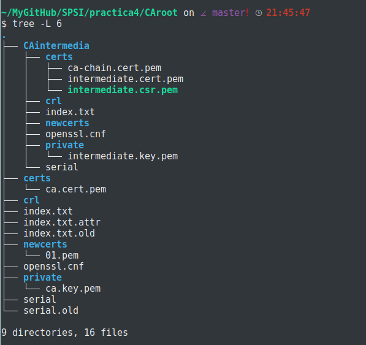

# Practica 4 SPSI

### 1. Crear una autoridad certificadora raíz. Mostrad los archivos creados y sus rutas, y los valores de las claves generadas.

Para poder crear nuestra propia autoridad certificadora raíz seguiremos estos pasos:

1. Creamos un directorio de trabajo para gestionar la información de los certificados expedidos:

2. Dentro del fichero creamos una estructura de ficheros tal que:

- En la carpeta __private__: se almacenarán las claves privadas utilizadas por la CA.
- En la carpeta __certs__: se archivarán los certificados emitidos.
- En la carpeta __newcerts__: se guardarán los nuevos certificados.
- En la carpeta __crl__: se archivan la lista de certificados revocados.

3. Para que el directorio este completo necesitamos dos archivos: "index.txt" y "serial".
El primero de ellos es el archivo de indice de la base de datos, el segundo contiene el numero serial de la serie de certificados, es decir, el número que se le asignará al próximo certificado creado.

4. Añadimos el archivo de configuración de openssl.cnf , como es muy extensa, dejaré una copia al final de dicho documento[1].

5. Pasamos a crear una clave privada para nuestra CA root:

> openssl genrsa -aes256 -out private/ca.key.pem 2048

***Nota1:*** El nombre de la key debe ser este por el archivo de configuración, si se desea cambiar, debe modificarlo en el archivo "openssl.cnf".
***Nota2:*** Contraseña de la key: 0123456789

6. Toca crear el certificado de la CA root , para ello utilizaremos nuestra clave privada "ca.key.pem":

> openssl req -config openssl.cnf -key private/ca.key.pem -new -x509 -days 365 -sha256 -extensions v3_ca -out certs/ca.cert.pem

De esta manera queda generado nuestro certificado: "ca.cert.pem"

7. En este momento abordamos el planteamiento del ***ejercicio 2:*** Crear una autoridad certificadora subordinada a la anterior.Mostrar los archivos creados y sus rutas, y los valores de las claves generadas.

Para ello crearemos una estructura como la de nuestra CA root con su propio archivo de configuración "openssl.cnf"[2].

8. Creamos su correspondiente key como hicimos con la CAroot:

> openssl genrsa -aes256 -out CAintermedia/private/intermediate.key.pem 2048

9. Ahora debemos crear un certificado intermedio de una forma similar a la que lo creamos en la CAroot:

> openssl req -config CAintermedia/openssl.cnf -new -sha256 -key CAintermedia/private/intermediate.key.pem -out CAintermedia/certs/intermediate.csr.pem

10. Ahora para crear el certificado intermedio mediante la CA root utilizamos la extensión v3_intermediate_ca firmando la CSR intermedia:

> openssl ca -config openssl.cnf -extensions v3_intermediate_ca -days 360 -md sha256 -in CAintermedia/cert/intermediate.csr.pem -out CAintermedia/certs/intermediate.cert.pem

De nuevo aclara que los nombres son debido a la configuración del archivo de openssl y que si quisieramos cambiarlos deberíamos ir a ese archivo para el correcto funcionamiento.

11. Verificamos el certificado intermedio:

> openssl verify -CAfile certs/ca.cert.pem CAintermedia/certs/intermediate.cert.pem

12. Nos falta juntar el certificado de la CA root y la CA intermedia:

> cat CAintermedia/certs/intermediate.cert.pem certs/ca.cert.pem > CAintermedia/certs/ca-chain.cert.pem

Ya tenemos nuestra CA root y nuestra CA intermedia de forma que si en algún momento queda expuesta nuestra "key intermedia" bastaría con eliminarla y crear otra "CA intermedia". De esta manera nunca podrán falsificarnos un certificado y/o expedirlos por nosotros.

***key privada CA root***

***key privada CA intermedia***

***Estructura***

### 3. Crear una solicitud de certificado que incluya la generación de claves en la misma. Mostrad los valores junto con el archivo.

Plantearemos a otra máquina, la cual tendrá una estructura igual que nuestra CAroot con su propio archivo de configuración de openssl.cnf[3]

> openssl req -nodes -newkey rsa:2048 -keyout private/solicitud.key.pem -out certs/solicitud.csr.pem -config openssl.cnf

De esta manera quedan generadas ambas cosas al mismo tiempo.

### 4. Crear un certificado para la solicitud anterior empleando la CA subordinada. Mostrar archivo y valores.

Para ello debemos mandar a la CA intermedia la solicitud. Después debe generarse el certificado tal que:

> mv CAother/certs/solicitud.csr.pem CAroot/CAintermedia/certs/

> openssl ca -config CAintermedia/openssl.cnf -extensions server_cert -days 320 -md sha256 -in CAintermedia/certs/solicitud.csr.pem -out CAintermedia/certs/solicitud.cert.pem

### 5.Cread una solicitud de certificado para cualquiera de las claves que habéis generado en las prácticas anteriores, excepto las RSA. Mostrad el archivo y el valor de la solicitud.

En mi caso escogeré una clave de la práctica 3 "GaleraECpriv.pem":

> openssl req -new -key private/GaleraECpriv.pem -out certs/Galera.csr.pem

### 6. Crear un certificado para la solicitud anterior utilizando la CA subordinada. Mostrar el archivo y los valores del certificado.

Al igual que antes, mandaríamos la solicitud al CA subordinada:

> mv CAej5/certs/Galera.csr.pem CAroot/CAintermedia/certs/

Y ahora generamos el certificado:

> openssl ca -config CAroot/CAintermedia/openssl.cnf -extensions server_cert -days 310 -md sha256 -in CAroot/CAintermedia/certs/Galera.csr.pem -out CAroot/CAintermedia/certs/Galera.cert.pem

De esta manera nuestro certificado ha sido creado con éxito.

----------------------------------

### [1]
~~~~
# OpenSSL root CA configuration file.

[ ca ]
# `man ca`
default_ca = CA_default

[ CA_default ]
# Directory and file locations.
dir               = /home/jota/MyGitHub/SPSI/practica4/CAroot
certs             = $dir/certs
crl_dir           = $dir/crl
new_certs_dir     = $dir/newcerts
database          = $dir/index.txt
serial            = $dir/serial
RANDFILE          = $dir/private/.rand

# The root key and root certificate.
private_key       = $dir/private/ca.key.pem
certificate       = $dir/certs/ca.cert.pem

# For certificate revocation lists.
crlnumber         = $dir/crlnumber
crl               = $dir/crl/ca.crl.pem
crl_extensions    = crl_ext
default_crl_days  = 30

# SHA-1 is deprecated, so use SHA-2 instead.
default_md        = sha256

name_opt          = ca_default
cert_opt          = ca_default
default_days      = 375
preserve          = no
policy            = policy_strict

[ policy_strict ]
# The root CA should only sign intermediate certificates that match.
# See the POLICY FORMAT section of `man ca`.
countryName             = match
stateOrProvinceName     = match
organizationName        = match
organizationalUnitName  = optional
commonName              = supplied
emailAddress            = optional

[ policy_loose ]
# Allow the intermediate CA to sign a more diverse range of certificates.
# See the POLICY FORMAT section of the `ca` man page.
countryName             = optional
stateOrProvinceName     = optional
localityName            = optional
organizationName        = optional
organizationalUnitName  = optional
commonName              = supplied
emailAddress            = optional

[ req ]
# Options for the `req` tool (`man req`).
default_bits        = 2048
distinguished_name  = req_distinguished_name
string_mask         = utf8only

# SHA-1 is deprecated, so use SHA-2 instead.
default_md          = sha256

# Extension to add when the -x509 option is used.
x509_extensions     = v3_ca

[ req_distinguished_name ]
# See <https://en.wikipedia.org/wiki/Certificate_signing_request>.
countryName                     = Country Name (2 letter code)
stateOrProvinceName             = State or Province Name
localityName                    = Locality Name
0.organizationName              = Organization Name
organizationalUnitName          = Organizational Unit Name
commonName                      = Common Name
emailAddress                    = Email Address

# Optionally, specify some defaults.
countryName_default             = GB
stateOrProvinceName_default     = England
localityName_default            =
0.organizationName_default      = Alice Ltd
organizationalUnitName_default  =
emailAddress_default            =

[ v3_ca ]
# Extensions for a typical CA (`man x509v3_config`).
subjectKeyIdentifier = hash
authorityKeyIdentifier = keyid:always,issuer
basicConstraints = critical, CA:true
keyUsage = critical, digitalSignature, cRLSign, keyCertSign

[ v3_intermediate_ca ]
# Extensions for a typical intermediate CA (`man x509v3_config`).
subjectKeyIdentifier = hash
authorityKeyIdentifier = keyid:always,issuer
basicConstraints = critical, CA:true, pathlen:0
keyUsage = critical, digitalSignature, cRLSign, keyCertSign

[ usr_cert ]
# Extensions for client certificates (`man x509v3_config`).
basicConstraints = CA:FALSE
nsCertType = client, email
nsComment = "OpenSSL Generated Client Certificate"
subjectKeyIdentifier = hash
authorityKeyIdentifier = keyid,issuer
keyUsage = critical, nonRepudiation, digitalSignature, keyEncipherment
extendedKeyUsage = clientAuth, emailProtection

[ server_cert ]
# Extensions for server certificates (`man x509v3_config`).
basicConstraints = CA:FALSE
nsCertType = server
nsComment = "OpenSSL Generated Server Certificate"
subjectKeyIdentifier = hash
authorityKeyIdentifier = keyid,issuer:always
keyUsage = critical, digitalSignature, keyEncipherment
extendedKeyUsage = serverAuth

[ crl_ext ]
# Extension for CRLs (`man x509v3_config`).
authorityKeyIdentifier=keyid:always

[ ocsp ]
# Extension for OCSP signing certificates (`man ocsp`).
basicConstraints = CA:FALSE
subjectKeyIdentifier = hash
authorityKeyIdentifier = keyid,issuer
keyUsage = critical, digitalSignature
extendedKeyUsage = critical, OCSPSigning

~~~~

### [2]

~~~~
# OpenSSL intermediate CA configuration file.

[ ca ]
# `man ca`
default_ca = CA_default

[ CA_default ]
# Directory and file locations.
dir               = /home/jota/MyGitHub/SPSI/practica4/CAroot/CAintermedia
certs             = $dir/certs
crl_dir           = $dir/crl
new_certs_dir     = $dir/newcerts
database          = $dir/index.txt
serial            = $dir/serial
RANDFILE          = $dir/private/.rand

# The root key and root certificate.
private_key       = $dir/private/intermediate.key.pem
certificate       = $dir/certs/intermediate.cert.pem

# For certificate revocation lists.
crlnumber         = $dir/crlnumber
crl               = $dir/crl/intermediate.crl.pem
crl_extensions    = crl_ext
default_crl_days  = 30

# SHA-1 is deprecated, so use SHA-2 instead.
default_md        = sha256

name_opt          = ca_default
cert_opt          = ca_default
default_days      = 375
preserve          = no
policy            = policy_loose

[ policy_strict ]
# The root CA should only sign intermediate certificates that match.
# See the POLICY FORMAT section of `man ca`.
countryName             = match
stateOrProvinceName     = match
organizationName        = match
organizationalUnitName  = optional
commonName              = supplied
emailAddress            = optional

[ policy_loose ]
# Allow the intermediate CA to sign a more diverse range of certificates.
# See the POLICY FORMAT section of the `ca` man page.
countryName             = optional
stateOrProvinceName     = optional
localityName            = optional
organizationName        = optional
organizationalUnitName  = optional
commonName              = supplied
emailAddress            = optional

[ req ]
# Options for the `req` tool (`man req`).
default_bits        = 2048
distinguished_name  = req_distinguished_name
string_mask         = utf8only

# SHA-1 is deprecated, so use SHA-2 instead.
default_md          = sha256

# Extension to add when the -x509 option is used.
x509_extensions     = v3_ca

[ req_distinguished_name ]
# See <https://en.wikipedia.org/wiki/Certificate_signing_request>.
countryName                     = Country Name (2 letter code)
stateOrProvinceName             = State or Province Name
localityName                    = Locality Name
0.organizationName              = Organization Name
organizationalUnitName          = Organizational Unit Name
commonName                      = Common Name
emailAddress                    = Email Address

# Optionally, specify some defaults.
countryName_default             = GB
stateOrProvinceName_default     = England
localityName_default            =
0.organizationName_default      = Alice Ltd
organizationalUnitName_default  =
emailAddress_default            =

[ v3_ca ]
# Extensions for a typical CA (`man x509v3_config`).
subjectKeyIdentifier = hash
authorityKeyIdentifier = keyid:always,issuer
basicConstraints = critical, CA:true
keyUsage = critical, digitalSignature, cRLSign, keyCertSign

[ v3_intermediate_ca ]
# Extensions for a typical intermediate CA (`man x509v3_config`).
subjectKeyIdentifier = hash
authorityKeyIdentifier = keyid:always,issuer
basicConstraints = critical, CA:true, pathlen:0
keyUsage = critical, digitalSignature, cRLSign, keyCertSign

[ usr_cert ]
# Extensions for client certificates (`man x509v3_config`).
basicConstraints = CA:FALSE
nsCertType = client, email
nsComment = "OpenSSL Generated Client Certificate"
subjectKeyIdentifier = hash
authorityKeyIdentifier = keyid,issuer
keyUsage = critical, nonRepudiation, digitalSignature, keyEncipherment
extendedKeyUsage = clientAuth, emailProtection

[ server_cert ]
# Extensions for server certificates (`man x509v3_config`).
basicConstraints = CA:FALSE
nsCertType = server
nsComment = "OpenSSL Generated Server Certificate"
subjectKeyIdentifier = hash
authorityKeyIdentifier = keyid,issuer:always
keyUsage = critical, digitalSignature, keyEncipherment
extendedKeyUsage = serverAuth

[ crl_ext ]
# Extension for CRLs (`man x509v3_config`).
authorityKeyIdentifier=keyid:always

[ ocsp ]
# Extension for OCSP signing certificates (`man ocsp`).
basicConstraints = CA:FALSE
subjectKeyIdentifier = hash
authorityKeyIdentifier = keyid,issuer
keyUsage = critical, digitalSignature
extendedKeyUsage = critical, OCSPSigning

~~~~

### [3]

~~~~
# OpenSSL root CA configuration file.

[ ca ]
# `man ca`
default_ca = CA_default

[ CA_default ]
# Directory and file locations.
dir               = /home/jota/MyGitHub/SPSI/practica4/CAother
certs             = $dir/certs
crl_dir           = $dir/crl
new_certs_dir     = $dir/newcerts
database          = $dir/index.txt
serial            = $dir/serial
RANDFILE          = $dir/private/.rand

# The root key and root certificate.
private_key       = $dir/private/ca.key.pem
certificate       = $dir/certs/ca.cert.pem

# For certificate revocation lists.
crlnumber         = $dir/crlnumber
crl               = $dir/crl/ca.crl.pem
crl_extensions    = crl_ext
default_crl_days  = 30

# SHA-1 is deprecated, so use SHA-2 instead.
default_md        = sha256

name_opt          = ca_default
cert_opt          = ca_default
default_days      = 375
preserve          = no
policy            = policy_strict

[ policy_strict ]
# The root CA should only sign intermediate certificates that match.
# See the POLICY FORMAT section of `man ca`.
countryName             = match
stateOrProvinceName     = match
organizationName        = match
organizationalUnitName  = optional
commonName              = supplied
emailAddress            = optional

[ policy_loose ]
# Allow the intermediate CA to sign a more diverse range of certificates.
# See the POLICY FORMAT section of the `ca` man page.
countryName             = optional
stateOrProvinceName     = optional
localityName            = optional
organizationName        = optional
organizationalUnitName  = optional
commonName              = supplied
emailAddress            = optional

[ req ]
# Options for the `req` tool (`man req`).
default_bits        = 2048
distinguished_name  = req_distinguished_name
string_mask         = utf8only

# SHA-1 is deprecated, so use SHA-2 instead.
default_md          = sha256

# Extension to add when the -x509 option is used.
x509_extensions     = v3_ca

[ req_distinguished_name ]
# See <https://en.wikipedia.org/wiki/Certificate_signing_request>.
countryName                     = Country Name (2 letter code)
stateOrProvinceName             = State or Province Name
localityName                    = Locality Name
0.organizationName              = Organization Name
organizationalUnitName          = Organizational Unit Name
commonName                      = Common Name
emailAddress                    = Email Address

# Optionally, specify some defaults.
countryName_default             = GB
stateOrProvinceName_default     = England
localityName_default            =
0.organizationName_default      = Alice Ltd
organizationalUnitName_default  =
emailAddress_default            =

[ v3_ca ]
# Extensions for a typical CA (`man x509v3_config`).
subjectKeyIdentifier = hash
authorityKeyIdentifier = keyid:always,issuer
basicConstraints = critical, CA:true
keyUsage = critical, digitalSignature, cRLSign, keyCertSign

[ v3_intermediate_ca ]
# Extensions for a typical intermediate CA (`man x509v3_config`).
subjectKeyIdentifier = hash
authorityKeyIdentifier = keyid:always,issuer
basicConstraints = critical, CA:true, pathlen:0
keyUsage = critical, digitalSignature, cRLSign, keyCertSign

[ usr_cert ]
# Extensions for client certificates (`man x509v3_config`).
basicConstraints = CA:FALSE
nsCertType = client, email
nsComment = "OpenSSL Generated Client Certificate"
subjectKeyIdentifier = hash
authorityKeyIdentifier = keyid,issuer
keyUsage = critical, nonRepudiation, digitalSignature, keyEncipherment
extendedKeyUsage = clientAuth, emailProtection

[ server_cert ]
# Extensions for server certificates (`man x509v3_config`).
basicConstraints = CA:FALSE
nsCertType = server
nsComment = "OpenSSL Generated Server Certificate"
subjectKeyIdentifier = hash
authorityKeyIdentifier = keyid,issuer:always
keyUsage = critical, digitalSignature, keyEncipherment
extendedKeyUsage = serverAuth

[ crl_ext ]
# Extension for CRLs (`man x509v3_config`).
authorityKeyIdentifier=keyid:always

[ ocsp ]
# Extension for OCSP signing certificates (`man ocsp`).
basicConstraints = CA:FALSE
subjectKeyIdentifier = hash
authorityKeyIdentifier = keyid,issuer
keyUsage = critical, digitalSignature
extendedKeyUsage = critical, OCSPSigning

~~~~
